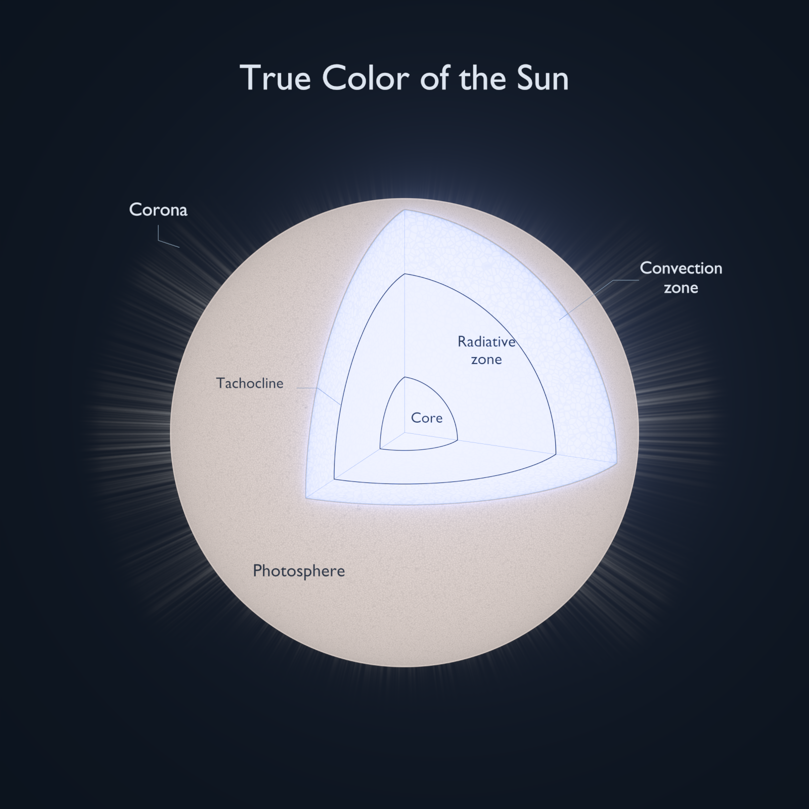

# Blender Sun cutaway

An editable, self-contained Blender visualization titled **True Color of the Sun**, showing the Sun with one octant removed and only its structure names. The three exposed cut faces reveal the core, radiative zone and convection zone; the surface includes an observed HMI continuum texture, illustrative granulation, a white corona and compositor glare.



## Open the finished scene

Open [`output/solar_cutaway.blend`](output/solar_cutaway.blend) in **Blender 5.2.x**. The project was tested with Blender 5.2.1. The scene includes packed source textures and uses Blender's built-in font, so no external texture or font paths are required.

Use **Rendered** viewport shading to see emission, and press **F12** for the composited render. In the Outliner, select **Solar brightness controls** and edit its custom properties to adjust the appearance. Hiding the **Annotations | hide for clean render** and **Layer guides | annotations** collections removes the labels and guides.

The main controls are:

| Control | Default | Effect |
| --- | ---: | --- |
| `solar_emission_gain` | 2.5 | Brightens the Sun after the reference brightness curve. |
| `glare_strength` | 0.35 | Adds Blender Fog Glow from the cut faces, with a gentler halo around the Sun. |
| `corona_strength` | 0.025 | Scales the faint white atmosphere independently. |
| `surface_texture` | 0.14 | Adjusts illustrative surface granulation. |
| `interior_texture` | 0.04 | Adjusts subtle internal plasma texture. |
| `display_power` | 0.60 | Compresses contrast after the logarithmic curve; smaller values lift dimmer material. |
| `display_peak` | 0.40 | Sets the reference display-luminance ceiling before emission gain. |

The shared curve also exposes `compression`, `reference_luminance` and `exposure_ev`. The saved scene contains a `READ ME | solar brightness and controls` text block with further implementation details.

## Rebuild and render

Only Blender is required to rebuild the scene. Blender supplies Python and NumPy; no add-ons, original project checkout, raw FITS files or data downloads are needed. The prepared input snapshot is included in `assets/`.

From this folder in PowerShell:

```powershell
.\scripts\render.ps1 -BlenderPath 'C:\path\to\blender.exe'
```

For a quicker preview:

```powershell
.\scripts\render.ps1 -BlenderPath 'C:\path\to\blender.exe' -Resolution 1400 -Samples 32
```

For CPU rendering:

```powershell
.\scripts\render.ps1 -BlenderPath 'C:\path\to\blender.exe' -Device CPU
```

`AUTO` is the default device choice: it uses OptiX when a compatible GPU is available and otherwise uses the CPU. Use `GPU` to explicitly request the supported GPU path.

The equivalent direct Blender command is:

```powershell
& 'C:\path\to\blender.exe' --background --factory-startup --python-exit-code 1 --python src/blender_sun.py -- --resolution 2400 --samples 96 --device AUTO --data-dir assets --output-dir output
```

On another operating system, use the same Blender arguments with that system's executable path. Default input and output locations are resolved from this project, so the generator does not depend on the shell's working directory when invoked by an absolute script path.

Rendering updates the editable `.blend` and writes:

| File in `output/` | Purpose |
| --- | --- |
| `solar_blender_annotated_preview.png` | Compact, labeled presentation included in Git. |
| `solar_blender_clean_preview.png` | Compact presentation without labels, included in Git. |
| `solar_blender_annotated.png` | Full-resolution, 16-bit labeled render. |
| `solar_blender_clean.png` | Full-resolution, 16-bit render without labels. |
| `solar_blender_reference.png` | Quantitative render with emission gain 1 and presentation effects disabled. |
| `solar_blender_presentation.json` | Display settings and the numerical brightness comparison. |

Full-resolution PNGs, rendering caches and Blender backup files are ignored by Git. The finished `.blend`, compact previews, input snapshot and source code are included.

## Brightness and scientific scope

Interior colors come from visible Planck spectra evaluated using CIE 1931 color matching functions and converted to linear sRGB. The temperature profile comes from Model S. The retained geometry is exactly seven eighths of a sphere, with the core boundary at 0.25 solar radii and the convection-zone base at 0.713 solar radii.

The prepared model's center-to-photosphere visible-luminance ratio is approximately **54,947:1**. A shared logarithmic curve followed by a power of **0.60** compresses the reference display ratio to **1.98:1**. The numerical reference mapping is recorded in `output/solar_blender_presentation.json`; the figure shows only the title and structure names. The illustrated Sun then receives **2.5× emission**, texture, corona and compositor glare, so its final pixels are not measurements of that reference ratio.

The surface observation is a relative HMI continuum proxy, not an absolute broadband calibration. Interior texture, surface granulation, corona density and glare are illustrative. The corona is enhanced separately for visibility. This hypothetical cutaway explains structure and relative brightness; it is not a direct observation of the solar interior. See [`assets/README.md`](assets/README.md) and [`assets/solar_blender_sources.json`](assets/solar_blender_sources.json) for provenance and source hashes.

## Validate

Run the native Blender checks against the saved scene:

```powershell
& 'C:\path\to\blender.exe' --background output/solar_cutaway.blend --python-exit-code 1 --python src/verify_blender_sun.py
& 'C:\path\to\blender.exe' --background output/solar_cutaway.blend --python-exit-code 1 --python src/verify_blender_brightness.py
```

Optional numerical tests and reference-image validation use a separate system Python environment:

```powershell
python -m venv .venv
.\.venv\Scripts\python.exe -m pip install -r requirements-dev.txt
.\.venv\Scripts\python.exe -m unittest discover -s tests -v
.\.venv\Scripts\python.exe -m src.verify_blender_render
```

Render at the default 2400-pixel resolution before the reference-image check so it has enough cut-face samples. That check compares the effects-free reference image with the spectral display calculation; it does not test the artistic glare render against physical radiance.
